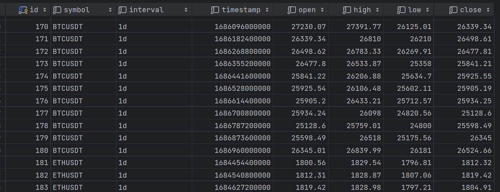
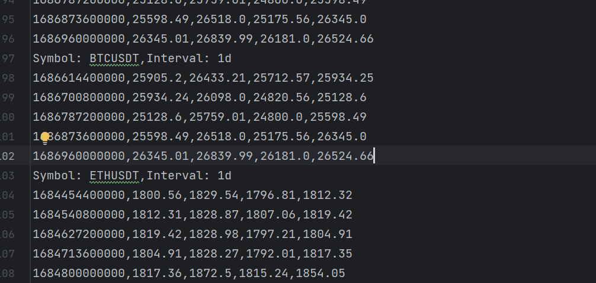
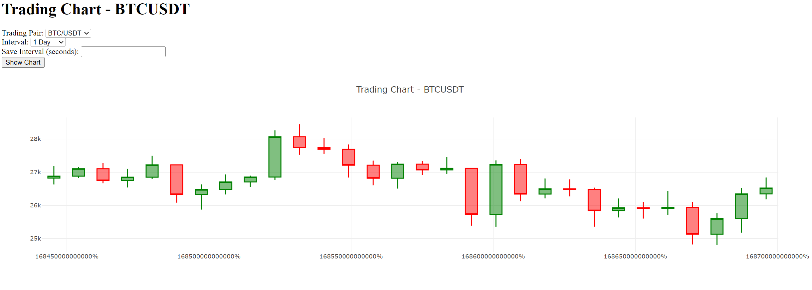

# Binance Candlestick Data
Binance Candlestick Data is a Flask application that allows you to retrieve and save candlestick data from the Binance exchange and display candlestick charts on a web page.

## Functionality  
* Retrieve candlestick data for a selected symbol (e.g., BTCUSDT, BNBUSDT, ETHUSDT) and interval (1 day, 4 hours, 1 hour) from the Binance exchange.

The user also has the ability to define the time interval at which the data will be saved in the UI - Save Interval field. By default, the interval will save data every 3600 seconds (1 hour).

I can also suggest adding a distributed task queue method, such as Celery. Additionally, it is possible to add a timer in the UI, which, once configured and activated, will initiate the saving of the specified data.

* Save the retrieved data to a CSV file (crypto_info/data.csv) and a PostgreSQL database.

Sample image of data stored in DB


Sample image of data stored in CSV


* Display a candlestick chart on the main page of the application.


## Tech

* Flask
* PosgreSQL
* Docker
* plotly

## Installation via GitHub
To install the application using GitHub, follow these steps:
1. Navigate to the folder on your computer where you want to clone the project.
2. Execute the following command:
```shell
git clone https://github.com/VladyslavCherkashyn/Binance-Data-Collector-and-Visualization.git
```
3. Change into the cloned project directory:
```shell
cd Binance-Data-Collector-and-Visualization
```
4. Create a virtual environment for the project:
```shell
python -m venv venv
```
5. Activate the virtual environment:
* On Windows:
```shell
venv\Scripts\activate
```
* On macOS:
```shell
source venv/bin/activate
```
6. Install the dependencies:
```shell
pip install -r requirements.txt
```
7. Run the bot:
```shell
python app.py
```
## Configuration
To work with the application, you need to create a .env file in the project's root folder and set the following environment variables:

(Get free API Key at [Binance](https://www.binance.com/))
* ACTUAL_API_KEY: {Your Binance API key}
* ACTUAL_SECRET_KEY: {Your Binance secret key}
* POSTGRES_HOST: {PostgreSQL database host}
* POSTGRES_DB: {PostgreSQL database name}
* POSTGRES_USER: {PostgreSQL database user}
* POSTGRES_PASSWORD: {PostgreSQL database password}

## Installation via Docker

* make sure you have installed [Docker](https://www.docker.com/products/docker-desktop/)
* Run ```docker-compose up --build```